# DataMgmtLab4

#### authors: Massimo Stefani, Eva Ray

## Remark

Technically, we could have done a group by for most of the exercises, but since we wanted to try the features of superset, we chose to instead use the "metrics" feature of the charts to aggregate the data.

## Exercise 1
```sql
SELECT *
FROM dimcustomer AS c
INNER JOIN dimgeography AS g
ON c.GeographyKey = g.GeographyKey
WHERE g.FrenchCountryRegionName = 'France';
```


## Exercise 2

```sql
SELECT dg.EnglishCountryRegionName
FROM dimcustomer dc 
JOIN dimgeography dg 
ON dc.GeographyKey = dg.GeographyKey
```

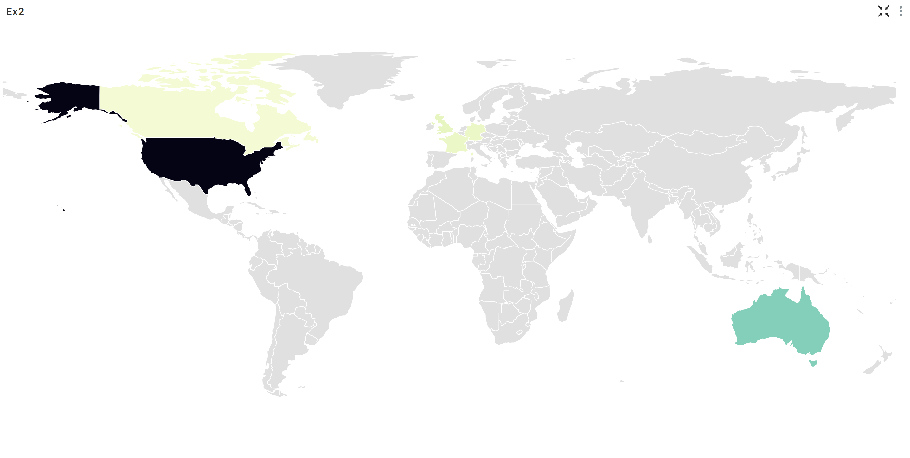

## Exercise 3

```sql
SELECT dpc.EnglishProductCategoryName, fs.OrderQuantity
FROM factresellersales fs
JOIN dimproduct dp
ON dp.ProductKey = fs.ProductKey
JOIN dimproductsubcategory dpsc
ON dp.ProductSubcategoryKey = dpsc.ProductSubcategoryKey
JOIN dimproductcategory dpc
ON dpsc.ProductCategoryKey = dpc.ProductCategoryKey
```


## Exercise 4

```sql
SELECT ds.ResellerName, frs.TotalProductCost
FROM dimreseller ds 
JOIN factresellersales frs 
ON ds.ResellerKey = frs.ResellerKey
```

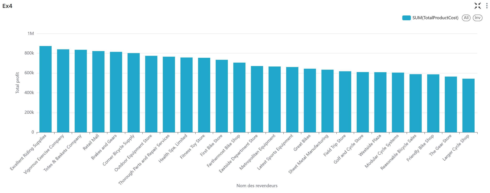
4
## Exercise 5

```sql
SELECT dt.FullDateAlternateKey AS sale_date, fs.OrderQuantity
FROM factresellersales fs
JOIN dimdate dt
ON fs.DueDateKey = dt.DateKey
```

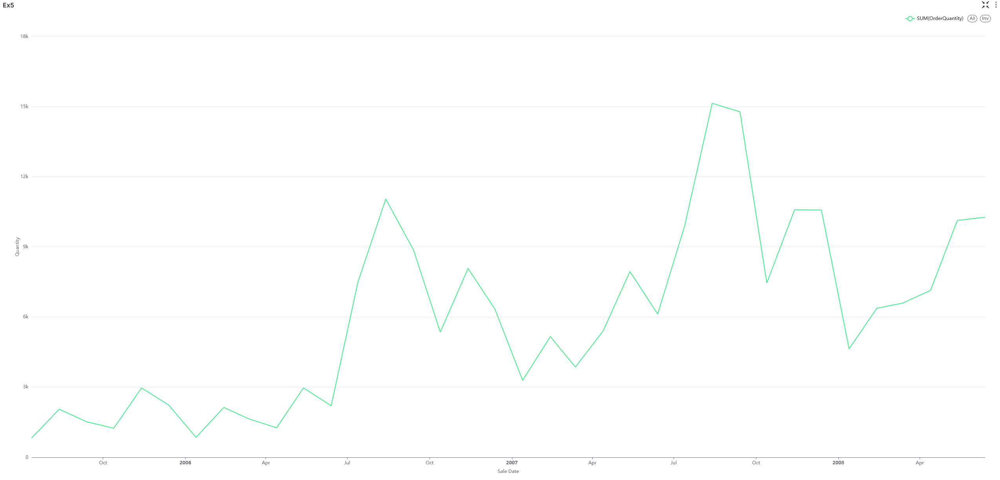

## Exercise 6

```sql
SELECT frs.OrderQuantity, d.FullDateAlternateKey AS SaleDate, pc.EnglishProductCategoryName AS Category
FROM factresellersales frs
JOIN dimdate d
ON frs.DueDateKey = d.DateKey
JOIN dimproduct p
ON frs.ProductKey = p.ProductKey
JOIN dimproductsubcategory psc
ON p.ProductSubcategoryKey = psc.ProductSubcategoryKey
JOIN dimproductcategory pc
ON psc.ProductCategoryKey = pc.ProductCategoryKey
```

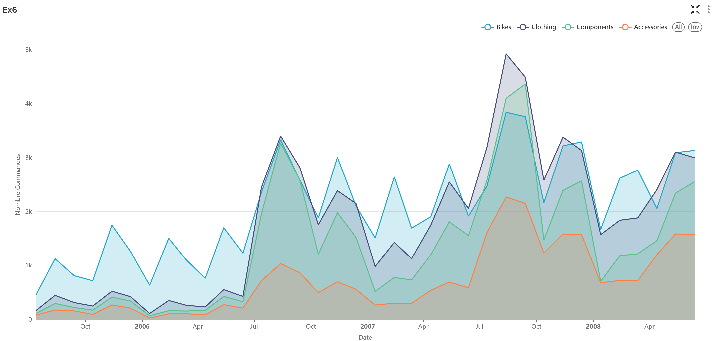

## Exercise 7

```sql
SELECT
    d.FullDateAlternateKey AS SaleDate,
    f.CustomerKey,
    SUM(f.SalesAmount) OVER (
        PARTITION BY f.CustomerKey
        ORDER BY d.FullDateAlternateKey
        ROWS BETWEEN UNBOUNDED PRECEDING AND CURRENT ROW
    ) AS CumulativeSales
FROM factinternetsales f
JOIN dimdate d
ON f.DueDateKey = d.DateKey
ORDER BY f.CustomerKey, d.FullDateAlternateKey;
```

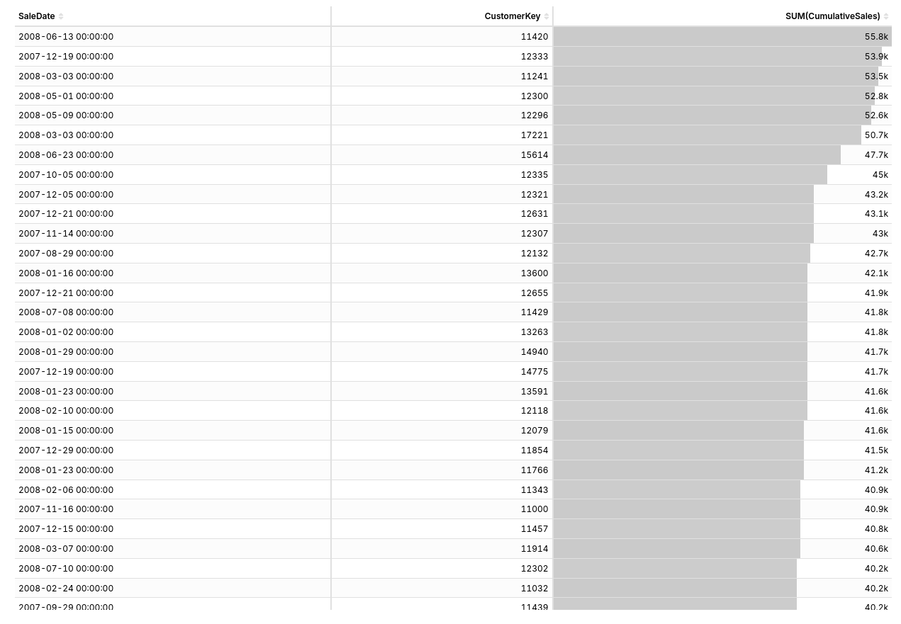

## Exercise 8

```sql
SELECT fis.OrderQuantity AS 'Order Quantity', d.FullDateAlternateKey AS 'Delivery Date', fis.CustomerKey AS 'Customer Id'
FROM factinternetsales fis
JOIN dimdate d
ON fis.DueDateKey = d.DateKey
```

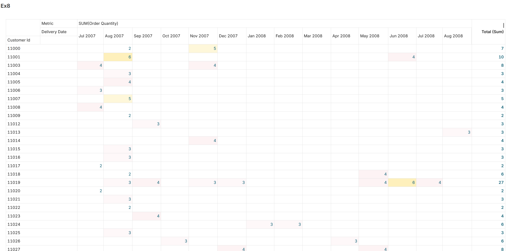

And another screenshot that shows values > 7.

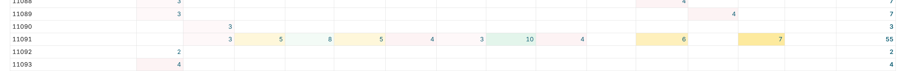

## Exercise 9
1. Give the main advantage of performing a visualization on the Web compared to a document (printed report for example). Then describe at least two examples of this advantage.
A Web visualization is dynamic and allows the user to manipulate the data, unlike a printed or static report.

- Example 1: Users can zoom, filter, highlight data points, change time ranges, and navigate through dimensions that cannot be shown in a fixed document.

- Example 2: A Web dashboard can refresh automatically using APIs or data streams. A printed document cannot reflect continuous or live changes.

2. Explain what the Shannon communication model (1948) has indirectly brought to the field of data visualization

The Shannon-Weaver model is one of the foundational theories of communication. It describes how information is transmitted from a sender to a receiver through a channel, with potential noise that can distort the message. 

It emphasizes the need to minimize noise (misinterpretation or confusion) and ensure that the intended message is accurately conveyed to the audience. This has led to the development of best practices in data visualization, such as choosing appropriate chart types, using clear labels, and designing for accessibility, all aimed at enhancing the clarity and effectiveness of visual communication.

- Noise reduction.
The model highlights the need to eliminate unnecessary elements. In visualization, removing visual clutter (chartjunk, redundant markers) increases the “capacity” of the graphic to convey information clearly.

- Efficient encoding of information.
As Shannon focuses on optimal encoding for maximum transmission, visualization must choose perceptually efficient encodings (position - length - angle - color) to minimize information loss.

- Receiver-centric design.
The model stresses correct decoding by the receiver. In data visualization, this translates to designing clear, interpretable graphics aligned with human perception.

Source: https://en.wikipedia.org/wiki/Shannon%E2%80%93Weaver_model


3. A scale has been applied to the time series data of the frst diagram in Figure 4, resulting in the display of the second diagram. Explain what this scale is and describe what information it gives compared to the frst diagram.

The second diagram results from applying a logarithmic scale to the values of the original time series.

A logarithmic transformation (typically log(x) or log10(x)) is applied to the y-axis.
Instead of representing raw values, the graph displays their logarithm.


Information gained compared to the first diagram

- On a linear scale, very large values dominate the chart and compress the smaller ones against the baseline. A logarithmic scale redistributes the space so both small and large values become interpretable. This prevents the graph from being visually distorted when data vary by factors of hundreds or thousands.

- Exponential or multiplicative processes form straight lines on a log scale. This transformation exposes patterns, consistency, or deviations that remain hidden on a linear axis, where the curve rapidly increases and becomes unreadable. It allows analysts to detect structure and assess growth behaviour more accurately.

Source: https://www.forbes.com/sites/naomirobbins/2012/01/19/when-should-i-use-logarithmic-scales-in-my-charts-and-graphs/

## Exercise 10

Let's create a heatmap that shows the number of sales per categories by country.

```sql
SELECT pc.EnglishProductCategoryName AS Category, g.EnglishCountryRegionName AS Country, frs.OrderQuantity
FROM factresellersales frs
JOIN dimproduct p
ON frs.ProductKey = p.ProductKey
JOIN dimproductsubcategory psc
ON p.ProductSubcategoryKey = psc.ProductSubcategoryKey
JOIN dimproductcategory pc
ON psc.ProductCategoryKey = pc.ProductCategoryKey
JOIN dimreseller dr 
ON dr.ResellerKey = frs.ResellerKey
JOIN dimgeography g
ON dr.GeographyKey = g.GeographyKey
```

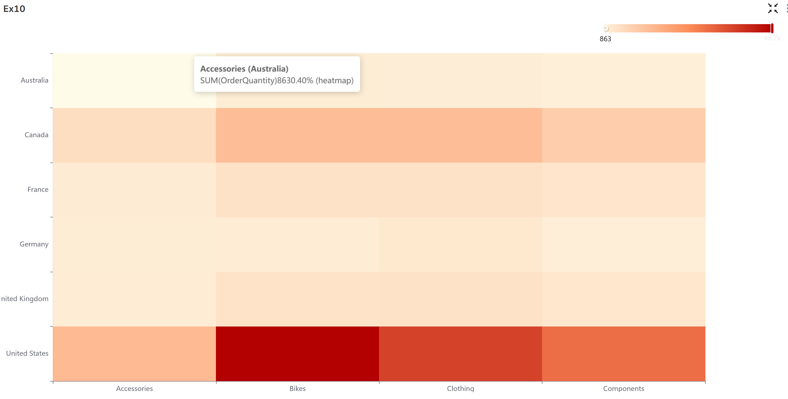

Here is a final display with a practical layout.

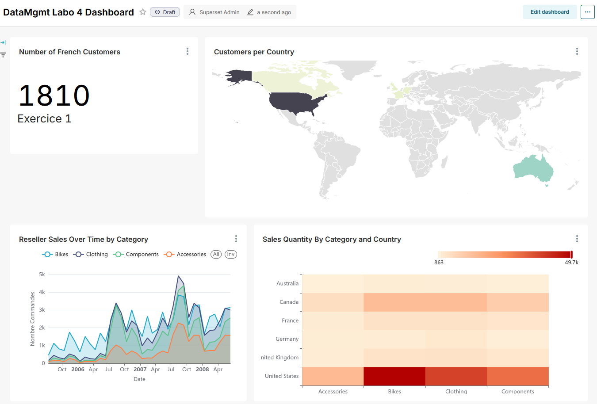

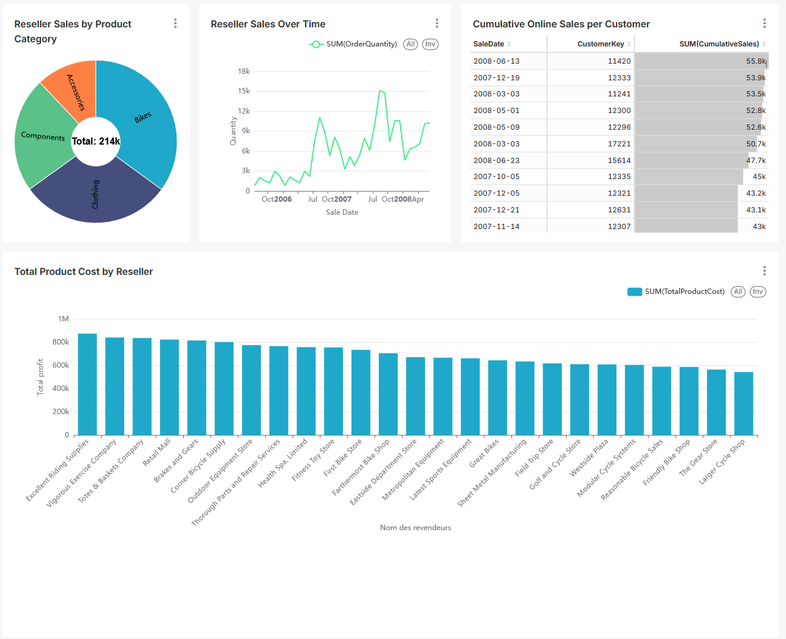

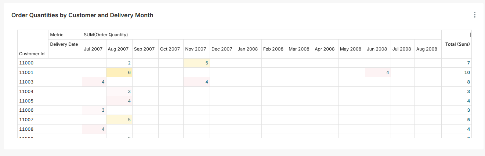